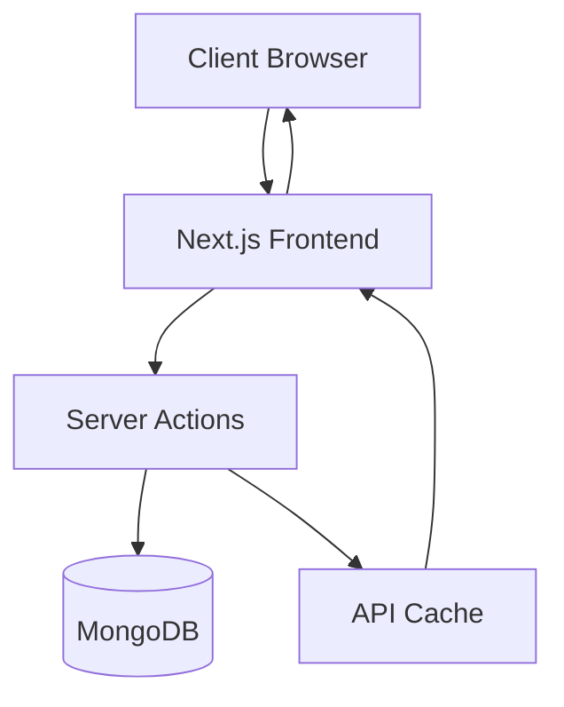

# WhatBytes Dashboard

A modern, responsive dashboard built with Next.js for visualizing skill assessment data and analytics.


## 🚀 Features

- **Real-time Analytics Dashboard**
  - Skill test performance metrics
  - Subject-wise analysis with progress bars
  - Interactive comparison graphs
  - Quick statistics overview

- **Performance Optimizations**
  - Server-side rendering with Next.js
  - API response caching
  - Automated path revalidation
  - Optimized image loading

- **Technology Stack**
  - Next.js 14
  - Tailwind CSS
  - MongoDB
  - Recharts
  - Server Actions

## 🏗️ Architecture



## 💻 Technical Implementation

### Data Flow
1. Client requests dashboard data
2. Next.js handles the request through server components
3. Server actions fetch data from MongoDB
4. Response is cached for improved performance
5. Path revalidation triggers on data updates
6. Optimized payload delivered to client

### Key Components
- **Dashboard Layout**: Main container with responsive grid system
- **Analytics Cards**: Reusable components for statistics
- **Charts**: Custom Recharts implementation
- **Progress Bars**: Subject-wise analysis visualization
- **API Layer**: RESTful endpoints with caching

## 🎨 Design Improvements

### Current Issues
- Inconsistent text hierarchy
- Irregular spacing between elements
- Multiple color variations
- Unclear comparison graph visualization

### Implemented Solutions
- Standardized typography system
  ```css
  /* Typography Scale */
  h1: text-2xl font-bold
  h2: text-xl font-semibold
  body: text-base font-normal
  ```
- Consistent spacing using Tailwind's spacing scale
- Reduced color palette to improve coherence
- Enhanced graph readability with better labels

### Future Enhancements
- [ ] Implement dark mode support
- [ ] Add more interactive tooltips
- [ ] Improve mobile responsiveness
- [ ] Enhance accessibility features
- [ ] Add data export functionality

## 🔧 Technical Improvements

### Current Implementation
```typescript
// Example of current caching implementation
export async function getData() {
  const cached = await cache.get('dashboard-data');
  if (cached) return cached;
  
  const data = await fetchFromMongoDB();
  await cache.set('dashboard-data', data);
  return data;
}
```

### Future Optimizations
- Implement stale-while-revalidate pattern
- Add error boundary components
- Optimize bundle size
- Implement progressive loading
- Add end-to-end testing

## 🔗 Links
- [Figma Design](your-figma-link)
- [Live Demo](your-demo-link)
- [API Documentation](your-api-docs-link)

## 📝 Additional Notes

The dashboard was built as part of the WhatBytes internship program, focusing on creating a modern, performant analytics interface. The project demonstrates proficiency in Next.js, state management, API integration, and modern web development practices.

For developers looking to contribute or maintain this project, please ensure to follow the established coding patterns and maintain the design system consistency.
